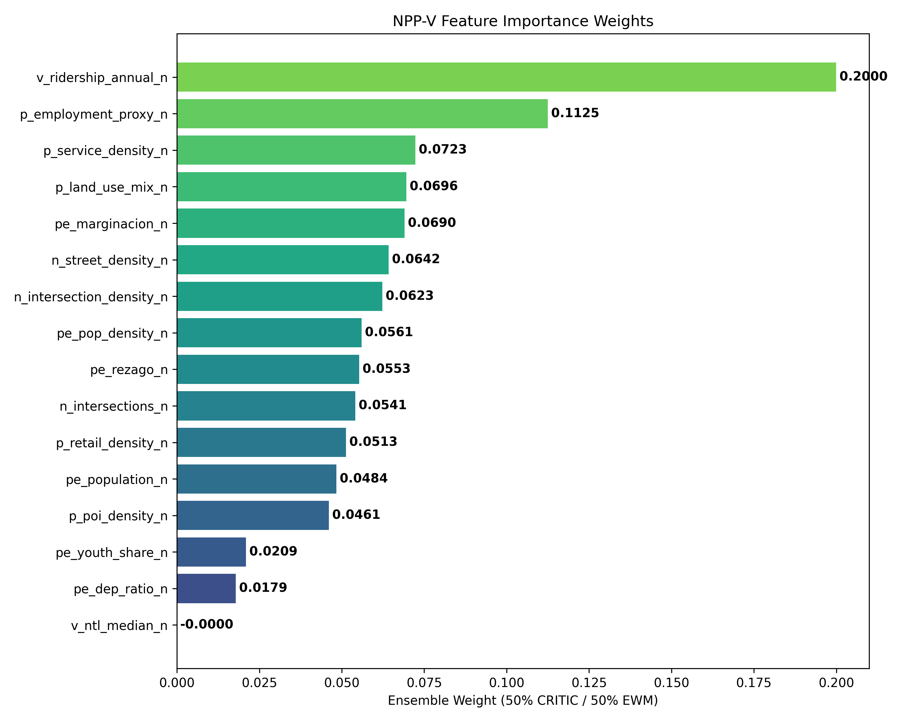
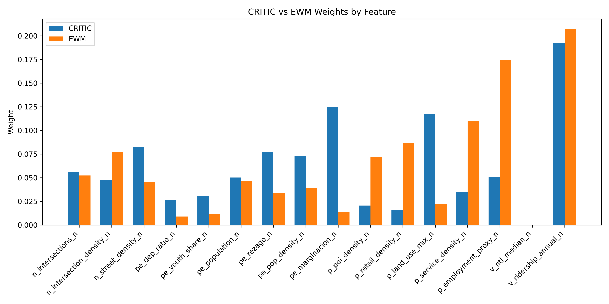

# Phase 3: Objective Indicator Weighting Report
*Generated on: 2026-05-11 21:10:18*

## Methodology
In this phase, we computed objective weights for the 16 normalized NPP-V features to remove subjective expert bias from the transit suitability model. We utilized two distinct methods:
1. **CRITIC**: Criteria Importance Through Intercriteria Correlation (measures contrast intensity and conflict).
2. **EWM**: Entropy Weight Method (measures information dispersion).

We then calculated an **Ensemble Weight** as the simple average of CRITIC and EWM to smooth out extremes.

## Feature Importance Summary
The table below ranks the features from highest to lowest ensemble weight.

| Rank | Feature | Dimension | CRITIC Weight | EWM Weight | Ensemble Weight |
|------|---------|-----------|---------------|------------|-----------------|
| 1 | `v_ridership_annual_n` | **VITALITY** | 0.1924 | 0.2075 | **0.2000** |
| 2 | `p_employment_proxy_n` | **PLACE** | 0.0506 | 0.1743 | **0.1125** |
| 3 | `p_service_density_n` | **PLACE** | 0.0344 | 0.1102 | **0.0723** |
| 4 | `p_land_use_mix_n` | **PLACE** | 0.1170 | 0.0222 | **0.0696** |
| 5 | `pe_marginacion_n` | **PEOPLE** | 0.1243 | 0.0137 | **0.0690** |
| 6 | `n_street_density_n` | **NODE** | 0.0827 | 0.0457 | **0.0642** |
| 7 | `n_intersection_density_n` | **NODE** | 0.0478 | 0.0768 | **0.0623** |
| 8 | `pe_pop_density_n` | **PEOPLE** | 0.0733 | 0.0388 | **0.0561** |
| 9 | `pe_rezago_n` | **PEOPLE** | 0.0771 | 0.0334 | **0.0553** |
| 10 | `n_intersections_n` | **NODE** | 0.0559 | 0.0523 | **0.0541** |
| 11 | `p_retail_density_n` | **PLACE** | 0.0162 | 0.0865 | **0.0513** |
| 12 | `pe_population_n` | **PEOPLE** | 0.0502 | 0.0466 | **0.0484** |
| 13 | `p_poi_density_n` | **PLACE** | 0.0205 | 0.0717 | **0.0461** |
| 14 | `pe_youth_share_n` | **PEOPLE** | 0.0307 | 0.0112 | **0.0209** |
| 15 | `pe_dep_ratio_n` | **PEOPLE** | 0.0268 | 0.0090 | **0.0179** |
| 16 | `v_ntl_median_n` | **VITALITY** | 0.0000 | -0.0000 | **-0.0000** |

## Weight Distributions

### Ensemble Feature Importance
This chart visualizes the final ensemble weights. Features with higher weights have stronger objective discrimination power across the Guadalajara Metropolitan Area.

### CRITIC vs EWM Comparison
This chart highlights how the two objective methods differ. CRITIC heavily penalizes highly correlated features, while EWM strictly measures variance/information gain.

## Conclusion
The weighting results confirm that **Vitality** (Ridership) and **Place** (Employment, Services) exert the most significant objective influence on establishing distinct transit corridors.
