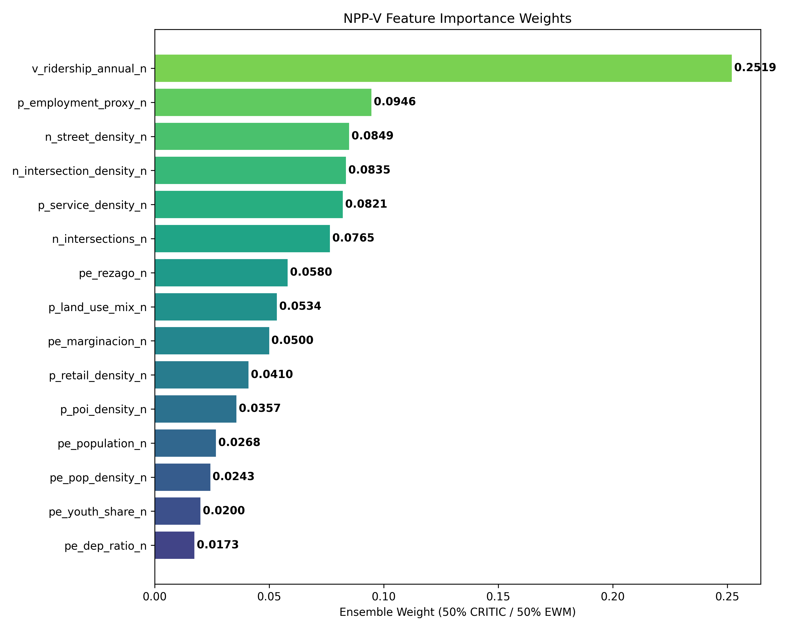
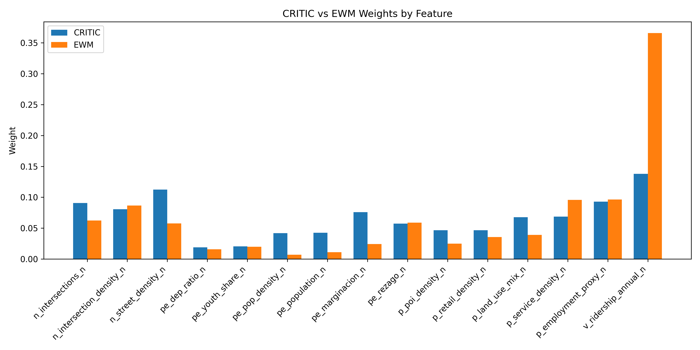

# Phase 3: Objective Indicator Weighting Report
*Generated on: 2026-06-14 23:22:42*

## Methodology
In this phase, we computed objective weights for the 16 normalized NPP-V features to remove subjective expert bias from the transit suitability model. We utilized two distinct methods:
1. **CRITIC**: Criteria Importance Through Intercriteria Correlation (measures contrast intensity and conflict).
2. **EWM**: Entropy Weight Method (measures information dispersion).

We then calculated an **Ensemble Weight** as the simple average of CRITIC and EWM to smooth out extremes.

## Feature Importance Summary
The table below ranks the features from highest to lowest ensemble weight.

| Rank | Feature | Dimension | CRITIC Weight | EWM Weight | Ensemble Weight |
|------|---------|-----------|---------------|------------|-----------------|
| 1 | `v_ridership_annual_n` | **VITALITY** | 0.1380 | 0.3659 | **0.2519** |
| 2 | `p_employment_proxy_n` | **PLACE** | 0.0929 | 0.0964 | **0.0946** |
| 3 | `n_street_density_n` | **NODE** | 0.1124 | 0.0574 | **0.0849** |
| 4 | `n_intersection_density_n` | **NODE** | 0.0805 | 0.0866 | **0.0835** |
| 5 | `p_service_density_n` | **PLACE** | 0.0686 | 0.0956 | **0.0821** |
| 6 | `n_intersections_n` | **NODE** | 0.0906 | 0.0624 | **0.0765** |
| 7 | `pe_rezago_n` | **PEOPLE** | 0.0571 | 0.0589 | **0.0580** |
| 8 | `p_land_use_mix_n` | **PLACE** | 0.0676 | 0.0391 | **0.0534** |
| 9 | `pe_marginacion_n` | **PEOPLE** | 0.0757 | 0.0242 | **0.0500** |
| 10 | `p_retail_density_n` | **PLACE** | 0.0466 | 0.0354 | **0.0410** |
| 11 | `p_poi_density_n` | **PLACE** | 0.0467 | 0.0247 | **0.0357** |
| 12 | `pe_population_n` | **PEOPLE** | 0.0426 | 0.0110 | **0.0268** |
| 13 | `pe_pop_density_n` | **PEOPLE** | 0.0417 | 0.0068 | **0.0243** |
| 14 | `pe_youth_share_n` | **PEOPLE** | 0.0203 | 0.0197 | **0.0200** |
| 15 | `pe_dep_ratio_n` | **PEOPLE** | 0.0188 | 0.0158 | **0.0173** |

## Weight Distributions

### Ensemble Feature Importance
This chart visualizes the final ensemble weights. Features with higher weights have stronger objective discrimination power across the Guadalajara Metropolitan Area.

### CRITIC vs EWM Comparison
This chart highlights how the two objective methods differ. CRITIC heavily penalizes highly correlated features, while EWM strictly measures variance/information gain.

## Conclusion
The weighting results confirm that **Vitality** (Ridership) and **Place** (Employment, Services) exert the most significant objective influence on establishing distinct transit corridors.
