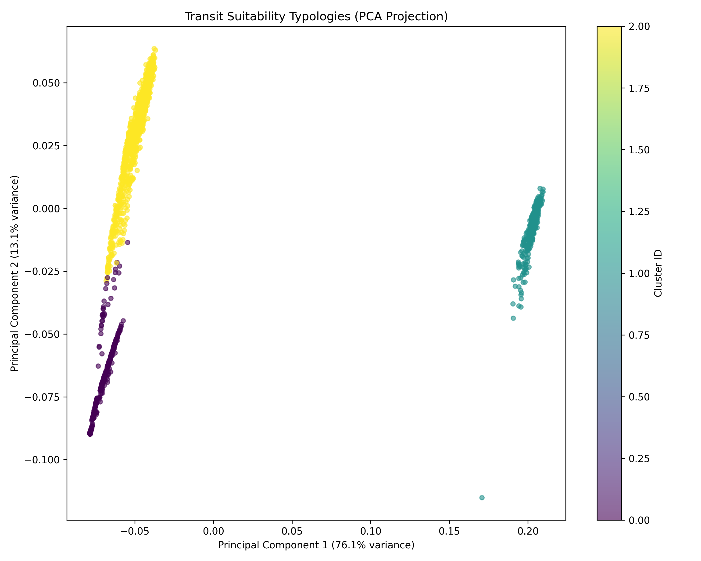

# Phase 4: Unsupervised Transit Suitability Clustering
*Generated on: 2026-06-14 23:28:23*

## Methodology
In Phase 4, we applied the Phase 3 ensemble weights to the 15 normalized NPP-V features (Vitality represented by `v_ridership_annual` only; `v_ntl_median` dropped per W0.1 errata). Using Scikit-Learn's **K-Means++** algorithm, we grouped the 2,068 AGEBs in the Guadalajara Metropolitan Area (ZMG) into distinct transit suitability typologies. The optimal number of clusters ($K$) was selected by maximizing the Silhouette Score.

## Cluster Visualization

The following PCA (Principal Component Analysis) scatter plot shows how the different typologies group together in a 2D projection based on their weighted feature distances.

## Typology Profiles
The table below shows the average normalized feature values for each cluster. Features closer to 1.0 indicate very high densities/values for that typology.

| Feature | Typology A | Typology B | Typology C |
|---------|---|---|---|
| `n_intersections_n` | 0.0092 | 0.7499 | 0.7366 |
| `n_street_density_n` | 0.0519 | 0.8925 | 0.8967 |
| `n_intersection_density_n` | 0.0003 | 0.7221 | 0.5447 |
| `p_poi_density_n` | 0.4306 | 0.7007 | 0.5354 |
| `p_employment_proxy_n` | 0.2242 | 0.6185 | 0.3888 |
| `p_retail_density_n` | 0.3544 | 0.5966 | 0.4512 |
| `p_service_density_n` | 0.1915 | 0.5870 | 0.3238 |
| `p_land_use_mix_n` | 0.4456 | 0.7651 | 0.6279 |
| `pe_population_n` | 0.6109 | 0.7985 | 0.7380 |
| `pe_pop_density_n` | 0.7409 | 0.8550 | 0.8130 |
| `pe_marginacion_n` | 0.7220 | 0.9454 | 0.8814 |
| `pe_rezago_n` | 0.2176 | 0.1611 | 0.2010 |
| `pe_dep_ratio_n` | 0.1525 | 0.1510 | 0.1566 |
| `pe_youth_share_n` | 0.1700 | 0.1770 | 0.1908 |
| `v_ridership_annual_n` | 0.0000 | 1.0000 | 0.0000 |

## Conclusion
These typologies directly translate into targeted urban transit policies. For example, a typology with high *Place/Vitality* but low *Node* connectivity represents a "Transit Desert" ripe for immediate BRT or Light Rail expansion.
