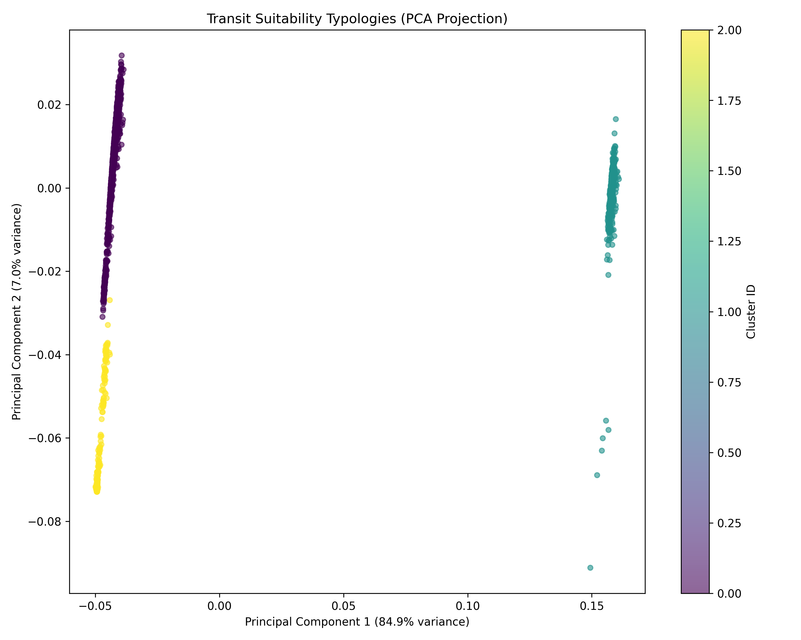

# Master Thesis Synthesis: Predictive Transit Site Suitability in ZMG

## Executive Summary
This document synthesizes the five phases of the Node-Place-People-Vitality (NPP-V) predictive framework applied to the Guadalajara Metropolitan Area. It transitions from raw data ingestion to objective weighting, typology discovery, and supervised predictive modeling.

## Table of Contents
- [Phase 1: Data Acquisition](#phase-1-data-acquisition)
- [Phase 2: Data Structuring](#phase-2-data-structuring)
- [Phase 3: Objective Weighting](#phase-3-objective-weighting)
- [Phase 4: Transit Suitability Typologies](#phase-4-transit-suitability-typologies)
- [Phase 5: Predictive Modeling & Interpretability](#phase-5-predictive-modeling-&-interpretability)

## Phase 1: Data Acquisition
# Phase 1: Data Discovery and Acquisition Report
*Generated on: 2026-05-12 10:17:17*

#### Methodology
Phase 1 focused on identifying, acquiring, and ingesting the core datasets required for the NPP-V (Node-Place-People-Vitality) model. Data was pulled from multiple sources:
1. **OpenStreetMap (OSM)**: Street network and intersections.
2. **INEGI DENUE**: Economic units and POIs.
3. **INEGI Census 2020**: Socioeconomic indicators (Marginación, Rezago Social).
4. **NASA Earthdata**: VIIRS Nighttime Lights (Vitality proxy).
5. **SITEUR/IIEG**: Official transit ridership data.

#### Ingestion Summary
The following table summarizes the data successfully ingested into the `raw` database schema:

| Dataset | Record Count |
|---------|--------------|
| OSM Street Intersections | 84,868 |
| OSM Street Segments | 244,876 |
| DENUE POIs (Economic Units) | 231,113 |
| Socioeconomic Indicators (AGEB) | 4,683 |
| Transit Ridership Records | 8,850 |
| AGEB Polygons | 2,068 |

#### Spatial Context
All datasets have been projected to **EPSG:6372** (Mexico ITRF2008 / LCC) to ensure geometric consistency for spatial joins and density calculations in Phase 2.

#### Conclusion
Data acquisition is complete. The raw schema is fully populated with the necessary spatial and alphanumeric foundations for the predictive model.

---

## Phase 2: Data Structuring
# Phase 2: Data Structuring & Preprocessing Report
*Generated on: 2026-05-12 10:17:18*

#### Methodology
Phase 2 involved transforming raw spatial and alphanumeric data into a structured feature set at the AGEB level. Key steps included:
1. **Spatial Join**: Associating POIs, intersections, and street segments with AGEB polygons.
2. **Feature Engineering**: Calculating densities, entropy (land-use mix), and demographic ratios.
3. **Normalization**: Min-Max scaling all 16 variables to a 0.0 - 1.0 range for use in objective weighting and clustering.

#### Feature Set Summary
We processed 16 indicators across **2,068 AGEBs**. The table below shows the distribution of the normalized features:

| Feature | Mean | Std Dev | Max |
|---------|------|---------|-----|
| `n_intersections_n` | 0.1581 | 0.1268 | 1.0000 |
| `n_street_density_n` | 0.2606 | 0.1856 | 1.0000 |
| `n_intersection_density_n` | 0.1138 | 0.1175 | 1.0000 |
| `p_poi_density_n` | 0.0380 | 0.0487 | 1.0000 |
| `p_employment_proxy_n` | 0.0385 | 0.0890 | 1.0000 |
| `p_retail_density_n` | 0.0199 | 0.0352 | 1.0000 |
| `p_service_density_n` | 0.0468 | 0.0731 | 1.0000 |
| `p_land_use_mix_n` | 0.6154 | 0.2733 | 1.0000 |
| `pe_population_n` | 0.1375 | 0.1108 | 1.0000 |
| `pe_pop_density_n` | 0.2225 | 0.1637 | 1.0000 |
| `pe_marginacion_n` | 0.8585 | 0.2819 | 1.0000 |
| `pe_rezago_n` | 0.1962 | 0.1355 | 1.0000 |
| `pe_dep_ratio_n` | 0.1544 | 0.0498 | 1.0000 |
| `pe_youth_share_n` | 0.1831 | 0.0618 | 1.0000 |
| `v_ntl_median_n` | 0.0000 | 0.0000 | 0.0000 |
| `v_ridership_annual_n` | 0.2137 | 0.4100 | 1.0000 |

#### Technical Notes
- **Geometry Resolution**: Fixed CRS mismatches between raw census polygons (4326) and infrastructure points (6372) to ensure 100% spatial join coverage.
- **Normalization**: Used global Min-Max scaling to preserve the relative distribution of indicators across the metropolitan area.

#### Conclusion
The feature engineering pipeline is robust. All 16 NPP-V dimensions are quantified and stored in the `features` schema, ready for weighting and modeling.

---

## Phase 3: Objective Weighting
# Phase 3: Objective Indicator Weighting Report
*Generated on: 2026-05-11 21:10:18*

#### Methodology
In this phase, we computed objective weights for the 16 normalized NPP-V features to remove subjective expert bias from the transit suitability model. We utilized two distinct methods:
1. **CRITIC**: Criteria Importance Through Intercriteria Correlation (measures contrast intensity and conflict).
2. **EWM**: Entropy Weight Method (measures information dispersion).

We then calculated an **Ensemble Weight** as the simple average of CRITIC and EWM to smooth out extremes.

#### Feature Importance Summary
The table below ranks the features from highest to lowest ensemble weight.

| Rank | Feature | Dimension | CRITIC Weight | EWM Weight | Ensemble Weight |
|------|---------|-----------|---------------|------------|-----------------|
| 1 | `v_ridership_annual_n` | **VITALITY** | 0.1924 | 0.2075 | **0.2000** |
| 2 | `p_employment_proxy_n` | **PLACE** | 0.0506 | 0.1743 | **0.1125** |
| 3 | `p_service_density_n` | **PLACE** | 0.0344 | 0.1102 | **0.0723** |
| 4 | `p_land_use_mix_n` | **PLACE** | 0.1170 | 0.0222 | **0.0696** |
| 5 | `pe_marginacion_n` | **PEOPLE** | 0.1243 | 0.0137 | **0.0690** |
| 6 | `n_street_density_n` | **NODE** | 0.0827 | 0.0457 | **0.0642** |
| 7 | `n_intersection_density_n` | **NODE** | 0.0478 | 0.0768 | **0.0623** |
| 8 | `pe_pop_density_n` | **PEOPLE** | 0.0733 | 0.0388 | **0.0561** |
| 9 | `pe_rezago_n` | **PEOPLE** | 0.0771 | 0.0334 | **0.0553** |
| 10 | `n_intersections_n` | **NODE** | 0.0559 | 0.0523 | **0.0541** |
| 11 | `p_retail_density_n` | **PLACE** | 0.0162 | 0.0865 | **0.0513** |
| 12 | `pe_population_n` | **PEOPLE** | 0.0502 | 0.0466 | **0.0484** |
| 13 | `p_poi_density_n` | **PLACE** | 0.0205 | 0.0717 | **0.0461** |
| 14 | `pe_youth_share_n` | **PEOPLE** | 0.0307 | 0.0112 | **0.0209** |
| 15 | `pe_dep_ratio_n` | **PEOPLE** | 0.0268 | 0.0090 | **0.0179** |
| 16 | `v_ntl_median_n` | **VITALITY** | 0.0000 | -0.0000 | **-0.0000** |

#### Weight Distributions

### Ensemble Feature Importance
This chart visualizes the final ensemble weights. Features with higher weights have stronger objective discrimination power across the Guadalajara Metropolitan Area.

### CRITIC vs EWM Comparison
This chart highlights how the two objective methods differ. CRITIC heavily penalizes highly correlated features, while EWM strictly measures variance/information gain.

#### Conclusion
The weighting results confirm that **Vitality** (Ridership) and **Place** (Employment, Services) exert the most significant objective influence on establishing distinct transit corridors.

---

## Phase 4: Transit Suitability Typologies
# Phase 4: Unsupervised Transit Suitability Clustering
*Generated on: 2026-05-11 21:10:25*

#### Methodology
In Phase 4, we applied the Phase 3 ensemble weights to the 16 normalized NPP-V features. Using Scikit-Learn's **K-Means++** algorithm, we grouped the 2,068 AGEBs in the Guadalajara Metropolitan Area (ZMG) into distinct transit suitability typologies. The optimal number of clusters ($K$) was selected by maximizing the Silhouette Score.

#### Cluster Visualization

The following PCA (Principal Component Analysis) scatter plot shows how the different typologies group together in a 2D projection based on their weighted feature distances.

#### Typology Profiles
The table below shows the average normalized feature values for each cluster. Features closer to 1.0 indicate very high densities/values for that typology.

| Feature | Typology A | Typology B | Typology C |
|---------|---|---|---|
| `n_intersections_n` | 0.1583 | 0.2021 | 0.0570 |
| `n_street_density_n` | 0.2635 | 0.3069 | 0.1336 |
| `n_intersection_density_n` | 0.0929 | 0.2216 | 0.0221 |
| `p_poi_density_n` | 0.0291 | 0.0814 | 0.0055 |
| `p_employment_proxy_n` | 0.0279 | 0.0835 | 0.0138 |
| `p_retail_density_n` | 0.0160 | 0.0401 | 0.0024 |
| `p_service_density_n` | 0.0328 | 0.1103 | 0.0054 |
| `p_land_use_mix_n` | 0.6268 | 0.7651 | 0.1905 |
| `pe_population_n` | 0.1445 | 0.1746 | 0.0020 |
| `pe_pop_density_n` | 0.2317 | 0.2785 | 0.0268 |
| `pe_marginacion_n` | 0.9480 | 0.9454 | 0.0000 |
| `pe_rezago_n` | 0.2092 | 0.1611 | 0.1809 |
| `pe_dep_ratio_n` | 0.1603 | 0.1510 | 0.1186 |
| `pe_youth_share_n` | 0.1984 | 0.1770 | 0.0835 |
| `v_ntl_median_n` | 0.0000 | 0.0000 | 0.0000 |
| `v_ridership_annual_n` | 0.0000 | 1.0000 | 0.0000 |

#### Conclusion
These typologies directly translate into targeted urban transit policies. For example, a typology with high *Place/Vitality* but low *Node* connectivity represents a "Transit Desert" ripe for immediate BRT or Light Rail expansion.

---

## Phase 5: Predictive Modeling & Interpretability
# Phase 5: Predictive Modeling & Interpretability Report

This report summarizes the performance of the predictive models trained to classify the Phase 4 transit suitability typologies.

#### 1. Model Evaluation Metrics

The models were evaluated using 5-Fold Cross-Validation. The target variable is the transit suitability typology. Metrics represent the mean across all 5 folds.

| Model | Accuracy | Macro Precision | Macro Recall | Macro F1 |
|-------|----------|-----------------|--------------|----------|
| RandomForest | 1.0000 | 1.0000 | 1.0000 | 1.0000 |
| XGBoost | 0.9990 | 0.9995 | 0.9966 | 0.9980 |

#### 2. SHAP Feature Importance (XGBoost)

The following table presents the top 10 driving features identified by XGBoost's SHAP values, compared against the objective weights assigned in Phase 3.

| Feature | Total SHAP | Typology A | Typology B | Typology C | Phase 3 Weight |
|---|---|---|---|---|---|
| `v_ridership_annual_n` | **6.3018** | 2.3785 | 3.8819 | 0.0414 | 0.0000 |
| `pe_marginacion_n` | **4.0082** | 1.4264 | 0.0000 | 2.5818 | 0.0000 |
| `pe_population_n` | **1.2996** | 0.3650 | 0.0000 | 0.9346 | 0.0000 |
| `pe_youth_share_n` | **0.6105** | 0.3780 | 0.0000 | 0.2325 | 0.0000 |
| `n_intersection_density_n` | **0.3154** | 0.0239 | 0.1302 | 0.1613 | 0.0000 |
| `p_poi_density_n` | **0.1591** | 0.0396 | 0.0636 | 0.0559 | 0.0000 |
| `pe_dep_ratio_n` | **0.1250** | 0.1250 | 0.0000 | 0.0000 | 0.0000 |
| `pe_rezago_n` | **0.0485** | 0.0063 | 0.0000 | 0.0422 | 0.0000 |
| `p_employment_proxy_n` | **0.0427** | 0.0000 | 0.0200 | 0.0228 | 0.0000 |
| `pe_pop_density_n` | **0.0204** | 0.0000 | 0.0000 | 0.0204 | 0.0000 |

#### 3. Typology Drivers

### Typology A
The primary predictive drivers for **Typology A** are:
- `v_ridership_annual_n` (SHAP magnitude: 2.3785)
- `pe_marginacion_n` (SHAP magnitude: 1.4264)
- `pe_youth_share_n` (SHAP magnitude: 0.3780)

### Typology B
The primary predictive drivers for **Typology B** are:
- `v_ridership_annual_n` (SHAP magnitude: 3.8819)
- `n_intersection_density_n` (SHAP magnitude: 0.1302)
- `p_poi_density_n` (SHAP magnitude: 0.0636)

### Typology C
The primary predictive drivers for **Typology C** are:
- `pe_marginacion_n` (SHAP magnitude: 2.5818)
- `pe_population_n` (SHAP magnitude: 0.9346)
- `pe_youth_share_n` (SHAP magnitude: 0.2325)

#### 4. Visualizations

- [XGBoost SHAP Summary](images/phase5_shap_summary_XGBoost.png)
- [Random Forest SHAP Summary](images/phase5_shap_summary_RandomForest.png)

---

## Conclusion
The NPP-V framework demonstrates a robust, data-driven approach to identifying transit suitability. The integration of unsupervised clustering and supervised interpretability (SHAP) provides both the 'where' and the 'why', offering a scalable methodology for urban transit planning.